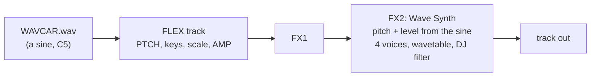

# `wave` — a wavetable synth on any sample track (experiment)

**An experiment.** WAVE turns a sample track into a 4-voice wavetable synth:
a voice ported from CHOMPI Club's open-source WAVE firmware
([CHOMPI-Club/CHOMPI](https://github.com/CHOMPI-Club/CHOMPI), MIT: its
wavetable oscillator, DJ filter and LFOs), running on the Octatrack's
DSP as an FX2 effect. The track plays a plain sine sample; WAVE hears its
pitch and its level and plays four voices at that pitch, shaped by that
level. So everything that moves a sample's pitch or volume plays the synth:
trigs, the CHROMATIC keys, PTCH and its locks, the scale quantizer, LFOs,
the AMP envelope.

It is built to be extended (more tables, its own envelope, per-voice notes,
a cheaper control path); [the module page](../../modules/wave/README.md)
says what is in it and what is open.

Not affiliated with or endorsed by CHOMPI Club or Chase Bliss, and not an official CHOMPI Club release; CHOMPI is CHOMPI Club's trademark (their `TRADEMARKS.md`), used here only to say where the code comes from.



## What is in it

- **Wave Synth** on the FX2 menu ([`modules/wave`](../../modules/wave/README.md)).
- **SCALE QUANTIZER** ([`modules/quantizer`](../../modules/quantizer/README.md)): PROJECT > CONTROL > SEQUENCER > SCALE and ROOT snap the PTCH knob, its locks and the CHROMATIC keys to a scale.
- **CC MAP**, **SCENES P2**, **PLOCKS P2**: Wave Synth's page-2 knobs from MIDI CC, in scenes and as parameter locks.
- **USB MIDI** and **USB AUDIO OUT TRACKS MAIN CUE**: the tracks to a computer over USB (track 1 on channels 1/2), for recording.
- Every stock effect except **DARK REV** and **SPRING REV**: Wave Synth runs in their DSP program space, so they are not on the menus.

### The knobs

| page | knob | what it does |
|---|---|---|
| 1 | FRAM | wavetable position: sine, triangle, saw, square, then narrower pulses; morphs between neighbours |
| 1 | CUT | DJ filter: low-pass below the middle, high-pass above |
| 1 | RES | resonance |
| 1 | CHRD | the four voices: UNI, OCT, 5TH, MAJ, MIN, MAJ7, MIN7, SUS4 |
| 1 | OCT | octaves below the sine: −4 … 0 (default −2: PTCH 0 plays C3) |
| 1 | LEVL | output level |
| 2 | FDEP, FRAT | filter LFO depth and rate |
| 2 | VDEP, VRAT | vibrato depth (up to ±2 semitones) and rate |
| 2 | DETN | spreads the four voices apart |

## What it costs

- DARK REV and SPRING REV, off both effect menus in this remix.
- Each Wave Synth track takes one FX2 memory buffer, as a stock delay or reverb does.
- DSP time: two Wave Synth tracks per core (tracks 1–4 are one core, tracks 5–8 the other). The module declares `max_per_core=2` and the offline counter prices two copies: 2 x 1,082 = 2,164 of 3,120 usable cycles per sample. A third is over the static DSP wall (3 x 1,082 = 3,246 > 3,120; the counter is a floor). The unit does not stop a third or fourth selection.
- Open: whether three or four instances on one core glitch on the unit is unmeasured.
- The track playing the sine: its own audio is replaced by the synth.

## Where it has run

- Sam's MKII, image 93 (3 Oct 2026): plays; PTCH and the CHROMATIC keys move the pitch; a looping sine with AMP at INF plays until the AMP envelope ends it.
- Under the DSP emulator: pitch within 0.25 cents of the sine's, chords, the envelope, eight instances at once ([module page](../../modules/wave/README.md), Measured).

## Getting it on the unit

1. Set up the repository and the stock OS: [BUILDING.md](../../docs/guide/BUILDING.md) sections 0–2.
2. Build the image and the sine:

   ```bash
   make image REMIX=wave BUILD=N                 # -> out/OCTATRACK_OCTABAMN.bin
   python3 modules/wave/carrier.py WAVCAR.wav    # the sine: C5, loops cleanly
   ```

3. USB DISK MODE on the unit. Copy `OCTATRACK_OCTABAMN.bin` to the card's root. Copy `WAVCAR.wav` into your set's audio pool: **`<set folder>/AUDIO/`**, the `AUDIO` folder inside the set (the folder that holds your projects), not the one at the card's root.
4. Eject, then PROJECT > OS UPGRADE > the image, and power-cycle.

## Playing it

1. A track: FLEX machine, sample WAVCAR.wav, loop on.
2. FX2 = **Wave Synth**. Turn the volume down for the first PLAY.
3. Trigs or the CHROMATIC keys play it. The AMP page is its envelope: with loop on and REL at INF it holds until the next note; lower HOLD and REL for notes that end.
4. PROJECT > CONTROL > SEQUENCER > SCALE and ROOT keep it in key.

The first 23 ms after Wave Synth is selected are silent while it builds its wavetables.

## Going back

Copy your previous image (or stock 1.40C) to the card's root and run OS UPGRADE again. On another octabam image a track left on Wave Synth plays NONE; before going back to stock, set those tracks' FX2 to a stock effect.
